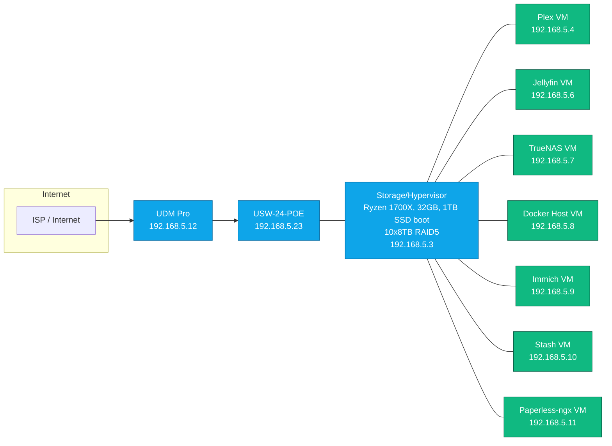

# Network & Topology

> Rendered view of the Mermaid diagram from `network-diagram.mmd`. If your viewer supports Mermaid, it will render below.

## IP Plan (192.168.5.0/24)
| Device | Role | IP | Notes |
|---|---|---:|---|
| UDM Pro | Firewall/Router | 192.168.5.12 | Original said `192.167.5.12` — assumed typo |
| USW-24-POE | Core Switch | 192.168.5.23 | UniFi managed |
| Storage/Hypervisor | Compute + Disks | 192.168.5.3 | 10×8TB RAID5 behind TrueNAS |
| Plex | Media Server | 192.168.5.4 | VM |
| Jellyfin | Media Server | 192.168.5.6 | VM |
| TrueNAS | Storage OS | 192.168.5.7 | VM / Bare-metal mgmt depends on your setup |
| Docker Host | Container Node | 192.168.5.8 | VM |
| Immich | Photos | 192.168.5.9 | VM |
| Stash | Media Indexer | 192.168.5.10 | VM |
| Paperless-ngx | Docs | 192.168.5.11 | VM |
